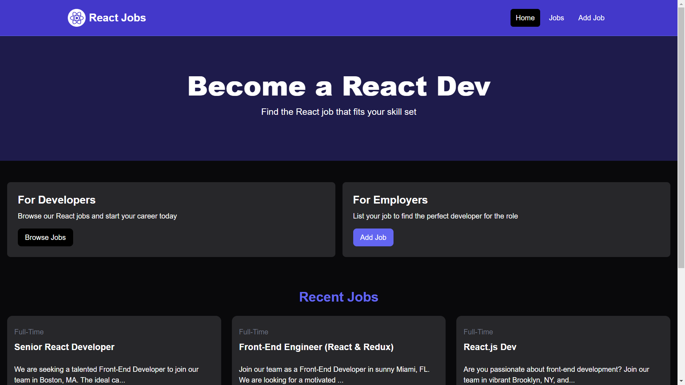

# React Jobs Web Application

## Introduction
The React Jobs Web Application is a platform designed to list, edit, and delete job postings. It provides functionalities for both job seekers and employers, allowing job seekers to browse available jobs and employers to list new job postings.


## Image



## Features
- **Job Listings:** Users can view a list of available job postings, including details such as job type, title, location, description, and salary.
- **Job Details:** Clicking on a job listing reveals additional details, including a full description of the job, company information, and contact details.
- **Adding New Jobs:** Employers can add new job postings by filling out a form with details such as job type, title, location, description, salary, company name, company description, contact email, and contact phone number.
- **Editing Jobs:** Employers can edit existing job postings by modifying the job details as needed.
- **Deleting Jobs:** Employers can delete job postings that are no longer relevant or needed.

## Components
- **Navbar:** Navigation bar component providing links to different sections of the application.
- **Hero:** Prominent title and subtitle welcoming users to the platform.
- **HomeCards:** Cards inviting users to browse job listings or add new job postings.
- **JobListings:** Displays a list of job postings fetched from the API.
- **JobListing:** Represents an individual job listing card with essential details.
- **ViewAllJobs:** Link to view all available jobs.
- **Spinner:** Loading spinner displayed while fetching data from the server.
- **AddJobPage:** Form for employers to add new job postings.
- **EditJobPage:** Form for employers to edit existing job postings.

## Technologies Used
- **React:** Front-end library for building user interfaces.
- **React Router:** Client-side routing for navigation.
- **React Icons:** Icon library for incorporating iconography.
- **Tailwind CSS:** Utility-first CSS framework for styling.
- **React Spinners:** Loading spinners for visual feedback.
- **React Router DOM:** Routing capabilities for React applications.
- **Fetch API:** Making HTTP requests to fetch data from the backend.
- **JavaScript (ES6+):** Modern JavaScript features for code readability.
- **React Toastify:** Toast notifications for user actions.

## Usage of React Toastify
React Toastify is integrated into the application to provide informative toast notifications for user actions. For example, to display an error toast notification when adding a job:

```javascript
import { toast } from 'react-toastify';

const submitForm = async (e) => {
  e.preventDefault();

  try {
    // Add job logic
    toast.success("Job added successfully");
  } catch (error) {
    toast.error("Error adding job: " + error.message);
  }
};
```

## Installation and Running the Project
To install and run the project locally, follow these steps:

1. Clone the repository: `git clone <repository-url>`
2. Navigate to the project directory: `cd react-jobs-web-app`
3. Install dependencies: `npm install`
4. Start the frontend server: `npm run dev`
4. Start the backend server: `npm run server`
5. Open your browser and visit [http://localhost:5173/](http://localhost:5173/) to view the application.
